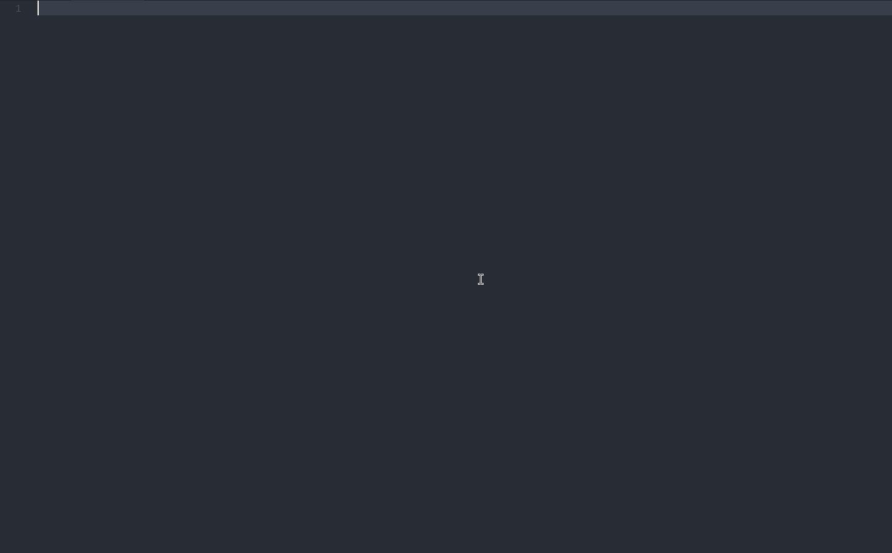

# React/Redux/react-router Snippets

Useful React Ecosystem snippets for [Visual Studio Code](https://code.visualstudio.com/), including:

* Quick import
* React
* Redux
* react-redux
* react-router

## Screenshot

## Usage

### import

| Trigger  | Content |
| -------: | ------- |
| `imr`    | `import React from 'react'` |
| `imrc`   | `import React, { Component } from 'react'` |
| `imd`    | `import { render } from 'react-dom'` |
| `impt`   | `import PropTypes from 'prop-types'` |
| `imc`    | `import ${1:componentName} from './Components/${1:componentName}'` |
| `imconnect`    | `import { connect } from 'react-redux'` |
| `improvider`    | `import { Provider } from 'react-redux'` |
| `imcreateSelector`    | `import { createSelector } from 'reselect'` |
| `imrr`   | `import { BrowserRouter, Route } from 'react-router-dom'` |
| `imnl`    | `import { NavLink } from 'react-router-dom'` |
| `imwr`    | `import { withRouter } from 'react-router-dom'` |

### React

| Trigger  | Content |
| -------: | ------- |
| `rcc→`   | class component skeleton |
| `rccp→`  | class component skeleton with prop types after the class |
| `rcjc→`  | class component skeleton without import and default export lines |
| `rcfc→`  | class component skeleton that contains all the lifecycle methods |
| `rsc→`   | stateless component skeleton |
| `rscp→`  | stateless component with prop types skeleton |
| `rpt→`   | empty propTypes declaration |
| `spt→`   | `static propTypes = {}` |
| `sdp→`   | `static defaultProps = {}` |
| `con→`   | class default constructor with props|
| `conc→`  | class default constructor with props and context |
| `est→`   | empty state object |
| `st→`   | Creates empty state object with ES7 synTax |
| `cwm→`   | `componentWillMount method` |
| `cdm→`   | `componentDidMount method` |
| `cwr→`   | `componentWillReceiveProps method` |
| `scu→`   | `shouldComponentUpdate method` |
| `cwup→`  | `componentWillUpdate method` |
| `cdup→`  | `componentDidUpdate method` |
| `cwun→`  | `componentWillUnmount method` |
| `ren→`   | `render method` |
| `sst→`   | `this.setState with object as parameter` |
| `ssf→`   | `this.setState with function as parameter` |
| `props→` | `this.props` |
| `state→` | `this.state` |
| `bnd→`   | `binds the this of method inside the constructor` |
| `pta→`   | `PropTypes.array,` |
| `ptar→`  | `PropTypes.array.isRequired,` |
| `ptb→`   | `PropTypes.bool,` |
| `ptbr→`  | `PropTypes.bool.isRequired,` |
| `ptf→`   | `PropTypes.func,` |
| `ptfr→`  | `PropTypes.func.isRequired,` |
| `ptn→`   | `PropTypes.number,` |
| `ptnr→`  | `PropTypes.number.isRequired,` |
| `pto→`   | `PropTypes.object.,` |
| `ptor→`  | `PropTypes.object.isRequired,` |
| `pts→`   | `PropTypes.string,` |
| `ptsr→`  | `PropTypes.string.isRequired,` |
| `ptnd→`  | `PropTypes.node,` |
| `ptndr→` | `PropTypes.node.isRequired,` |
| `ptel→`  | `PropTypes.element,` |
| `ptelr→` | `PropTypes.element.isRequired,` |
| `pti→`   | `PropTypes.instanceOf(ClassName),` |
| `ptir→`  | `PropTypes.instanceOf(ClassName).isRequired,` |
| `pte→`   | `PropTypes.oneOf(['News', 'Photos']),` |
| `pter→`  | `PropTypes.oneOf(['News', 'Photos']).isRequired,` |
| `ptet→`  | `PropTypes.oneOfType([PropTypes.string, PropTypes.number]),` |
| `ptetr→` | `PropTypes.oneOfType([PropTypes.string, PropTypes.number]).isRequired,` |
| `ptao→`  | `PropTypes.arrayOf(PropTypes.number),` |
| `ptaor→` | `PropTypes.arrayOf(PropTypes.number).isRequired,` |
| `ptoo→`  | `PropTypes.objectOf(PropTypes.number),` |
| `ptoor→` | `PropTypes.objectOf(PropTypes.number).isRequired,` |
| `ptsh→`  | `PropTypes.shape({color: PropTypes.string, fontSize: PropTypes.number}),` |
| `ptshr→` | `PropTypes.shape({color: PropTypes.string, fontSize: PropTypes.number}).isRequired,` |

### Redux

| Trigger  | Content |
| -------: | ------- |
| `rat`  | Redux constant(actionTypes) |
| `rac`  | Redux actionCreator |
| `reducer`  | Redux reducer |
| `store`  | Redux store |
| `selector`  | Redux selector |

### react-redux

| Trigger  | Content |
| -------: | ------- |
| `imconnect`    | `import { connect } from 'react-redux'` |
| `improvider`    | `import { Provider } from 'react-redux'` |
| `provider`  | react-redux Provider Container |
| `mstp`  | mapStateToProps |
| `mdtp`  | mapDispatchToProps |
| `connect`  | react-redux connect React Component |
| `container`  | Redux container |

### react-router

| Trigger  | Content |
| -------: | ------- |
| `imrr`   | `import { BrowserRouter as Router, Route } from 'react-router-dom'` |
| `imnl`    | `import { NavLink } from 'react-router-dom'` |
| `imwr`    | `import { withRouter } from 'react-router'` |
| `router`  | react-router Router template |
| `route`  | react-router  Route component |
| `navlink`  | react-router  NavLink component |

## Contributors

* [YutHelloWorld](https://github.com/YutHelloWorld)

## Acknowledgments

* [Reactjs code snippets](https://marketplace.visualstudio.com/items?itemName=xabikos.ReactSnippets)
* [React-Native/React/Redux snippets for es6/es7](https://marketplace.visualstudio.com/items?itemName=EQuimper.react-native-react-redux)
* [React Redux ES6 Snippets](https://marketplace.visualstudio.com/items?itemName=timothymclane.react-redux-es6-snippets)
* [redux-snippets](https://marketplace.visualstudio.com/items?itemName=jameshrisho.redux-snippets)

## License

[MIT](LICENSE)
